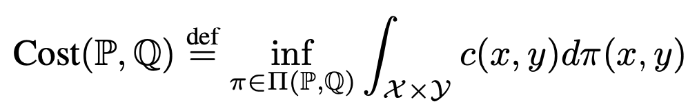
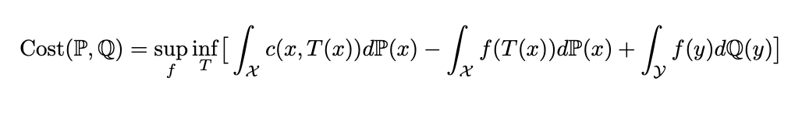
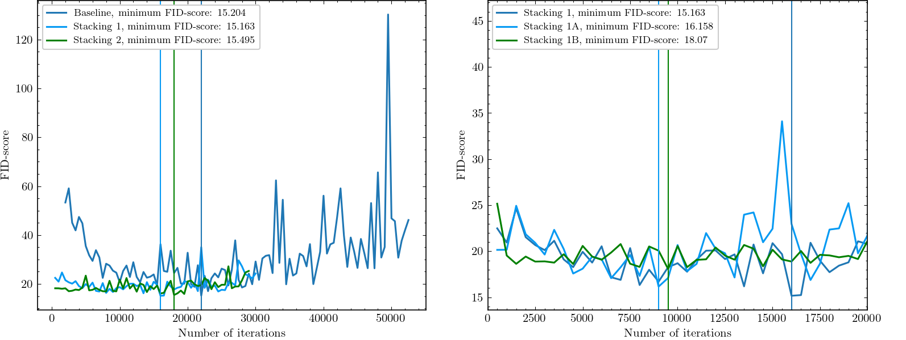

# Stacking Neural Optimal Transport (SNOT)

  
Table of Contents

  <ol>
    <li>
      <a href="#theoretical-background">Theoretical background</a>
      <ul>
        <li><a href="#strong-ot">Strong OT</a></li>
        <li><a href="#dual-problem">Dual problem</a></li>
        <li><a href="#maxmin-reformulation-of-the dual-problem">Maxmin reformulation of the dual problem</a></li>
        <li><a href="#hypothesis">Hypothesis</a></li>
      </ul>
    </li>
     <li><a href="#paper-and-presentation">Paper and Presentation</a></li>
    <li>
      <a href="#notebooks-and-conducted-experimnets">Notebooks and conducted experimnets</a>
      <ul>
        <li><a href="#baseline">Baseline</a></li>
        <li><a href="#stacking1">Stacking1</a></li>
        <li><a href="#stacking2">Stacking2</a></li>
      </ul>
    </li>
    <li><a href="#obtained-results">Obtained results</a></li>
    <li><a href="#references">References</a></li>
    <li><a href="#contacts">Contacts</a></li>
    <li><a href="#license">License</a></li>
  </ol>

Solving **optimal transport** (OT) problems with neural networks is a widespread topic in machine learning. It is shown that
corresponding algorithms can be applied to large-scale computer vision tasks [[1]](https://arxiv.org/abs/2201.12220). 

Also, such models as Wasserstain GANs uses **optimal transport** as a loss function to update the generator models in a generative simulation problem [[2]](https://proceedings.mlr.press/v70/arjovsky17a/arjovsky17a.pdf). 

In this project the unsupervised style-transfer problem is being solved.

    

## Theoretical background
A common task in machine learning is to optimize the distance between some probability distributions $P$ and $Q$.

### Strong OT 
In this project *strong* OT problem is solved, where cost function is defined as:

    

The problem is hard to solve in such form. Hence, the dual form of problem have to be described. 

### Dual problem
Dual problem for *strong* costs is well-known as the Kantorovich duality. Detailed explanation of conversion from primal to dual form is presented in [[1]](https://arxiv.org/abs/2201.12220). 

### Maxmin reformulation of the dual problem
Using the results of the paper, maxmin reformulation of the dual problem:

    

* Parameterize $f$ and $T$ by $θ$, $φ$ via neural networks,
* Fix $f$ and solve the inner optimization problem,
* Fix $T$ and solve the outer problem.

### Hypothesis
`Can a stacking-like approach improve the performance of neural optimal transport?`

By using a *stacking-like* approach, we run the **neural optimal transport** algorithm on the initial distribution $P$, and get some modified distribution $Q_1$ that differs from the final desired distribution $Q$. 

The idea is to check whether the distribution $Q_k$ gradually converges to the true distribution $Q$. The FID score is used to check convergence.

## Paper and Presentation
Stacking Neural Optimal Transport final project defence in machine learning course (24 March 2023, Eng, [slides](./presentation/Team_4_SNOT.pptx), [paper](./paper/SNOT.pdf))

## Notebooks and Conducted experiments
* Original notebooks with full-fledged conducted experiments are in the [stacking_notebooks](https://github.com/barracuda049/Stacking_NOT/tree/main/stacking_notebooks) folder.

* For further research please use [SNOT_strong.ipynb](https://github.com/barracuda049/Stacking_NOT/blob/main/SNOT_strong.ipynb). This notebook collects notebooks from [stacking_notebooks](https://github.com/barracuda049/Stacking_NOT/tree/main/stacking_notebooks) folder in one place.

* Do not forget to download *"shoes_64.hdf5"* and *"handbag_64.hdf5"* to the folder *"data"* from [datasets](https://github.com/junyanz/iGAN/blob/master/train_dcgan/README.md).

### Block-diagram of conducted experiments

    

### Baseline

    

### Stacking1

    

### Stacking2

    

## Obtained results

    

* Thus, statistically significant improvement of the FID-metric is not achieved
* Recommendation: Check *stacking-like* approach on *weak* NOT

## References
* The project was inspired by a [paper](https://openreview.net/forum?id=d8CBRlWNkqH) published by [Alexander Korotin](https://scholar.google.ru/citations?user=1rIIvjAAAAAJ&hl=en), [Daniil Selikhanovych](https://scholar.google.com/citations?user=ZpZhN3QAAAAJ&hl=en) and [Evgeny Burnaev](https://scholar.google.ru/citations?user=pCRdcOwAAAAJ&hl=ru), and this GitHub [repository](https://github.com/iamalexkorotin/NeuralOptimalTransport)

## Contacts
* [barracuda049](https://github.com/barracuda049)
* [GibsonGrid](https://github.com/GibsonGrid)
* [mak7474](https://github.com/mak7474)
* [mvulf](https://github.com/mvulf)
* [Tonchik-hv](https://github.com/Tonchik-hv)

## License
MIT License

Copyright (c) 2023 Antonina Kurduykova, Matvey Skripkin, Mikhail Koksharov, Mikhail Vulf, Nikita Ligostaev

Permission is hereby granted, free of charge, to any person obtaining a copy
of this software and associated documentation files (the "Software"), to deal
in the Software without restriction, including without limitation the rights
to use, copy, modify, merge, publish, distribute, sublicense, and/or sell
copies of the Software, and to permit persons to whom the Software is
furnished to do so, subject to the following conditions:

The above copyright notice and this permission notice shall be included in all
copies or substantial portions of the Software.

THE SOFTWARE IS PROVIDED "AS IS", WITHOUT WARRANTY OF ANY KIND, EXPRESS OR
IMPLIED, INCLUDING BUT NOT LIMITED TO THE WARRANTIES OF MERCHANTABILITY,
FITNESS FOR A PARTICULAR PURPOSE AND NONINFRINGEMENT. IN NO EVENT SHALL THE
AUTHORS OR COPYRIGHT HOLDERS BE LIABLE FOR ANY CLAIM, DAMAGES OR OTHER
LIABILITY, WHETHER IN AN ACTION OF CONTRACT, TORT OR OTHERWISE, ARISING FROM,
OUT OF OR IN CONNECTION WITH THE SOFTWARE OR THE USE OR OTHER DEALINGS IN THE
SOFTWARE.
