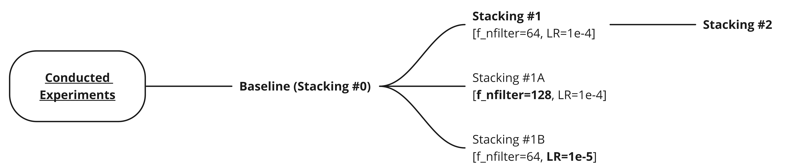

    <h1>Stacking NOT</h1>
     
    
     

## Presentation 

Stacking Neural Optimal Transport final project defence in machine learning course (24 March 2023, Eng, [slides](./presentation/Team_4_SNOT.pptx))

## Conducted experiments

* Handbags, shoes [datasets](https://github.com/junyanz/iGAN/blob/master/train_dcgan/README.md)

    

    <h3>Baseline</h3>
    

    <h3>Stacking 1</h3>
    

    <h3>Stacking 2</h3>
    

<h3>Obtained results</h3>

    
    

## References

* This project was based on this [paper](https://openreview.net/forum?id=d8CBRlWNkqH) by [Alexander Korotin](https://scholar.google.ru/citations?user=1rIIvjAAAAAJ&hl=en), [Daniil Selikhanovych](https://scholar.google.com/citations?user=ZpZhN3QAAAAJ&hl=en) and [Evgeny Burnaev](https://scholar.google.ru/citations?user=pCRdcOwAAAAJ&hl=ru) and this GitHub [repository](https://github.com/iamalexkorotin/NeuralOptimalTransport)

## Contacts

* [barracuda049](https://github.com/barracuda049)
* [GibsonGrid](https://github.com/GibsonGrid)
* [mak7474](https://github.com/mak7474)
* [mvulf](https://github.com/mvulf)
* [Tonchik-hv](https://github.com/Tonchik-hv)

## License

MIT

---

